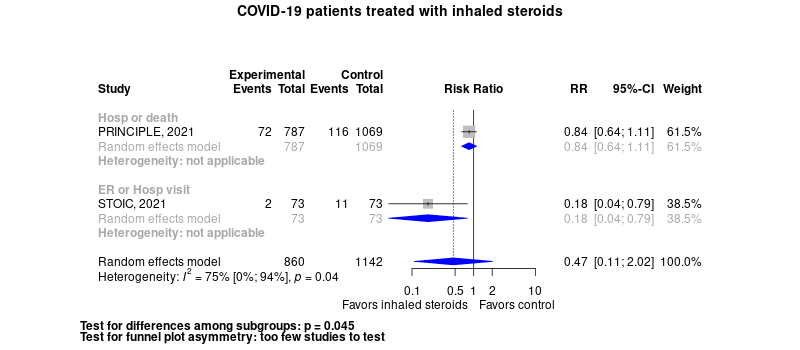

COVID-19 ambulatory patient treatments with inhaled steroids
============================================
A living systematic review

Short url: https://openmetaanalysis.github.io/covid-19/

**Clinical summary:** This meta-analysis suggests that clinical intervention *is likely not* effective. Heterogeneity of results as measured by I2 was '[substantial](http://handbook-5-1.cochrane.org/chapter_9/9_5_2_identifying_and_measuring_heterogeneity.htm)' at 75%. This review updates previously published meta-analysis(es).(citation[s] below)

<!--
Meta-regression of common modulators (year of publication, study size, event rate in the control groups) finds that the outcome of the intervention is effected by xx.

* [Reconciliation of studies and conclusions with prior meta-analyses](files/reconciliation-tables/Reconciliation%20of%20studies%20and%20conclusions.pdf)
* [Keep current with this topic](files/searching/Keep-up.md)
-->
Acknowledgement: we acknowledge the essential work by the authors of the prior [systematic review(s)](#systematic-reviews) listed below.

**Methods overview:** This repository is an [openMetaAnalysis](https://openmetaanalysis.github.io/) that combines methods of scoping, rapid, and living systematic reviews.  This analysis updates one or more previously published review(s) below. A comparison of studies included in this review compared to prior reviews are in the table, [reconciliation of trials included with prior meta-analyses/](files/reconciliation-tables/Reconciliation%20of%20studies.pdf). Newer studies included are listed in the references below. Rationale for newer trials excluded may be listed at the end of the references. 
* [Methods](http://openmetaanalysis.github.io/methods.html) for openMetaAnalysis
* [Evidence search](files/searching/evidence-search.md) for this review (under construction)

**Results:** Details of the studies included are in the:
* [Reconciliation of studies and conclusions with prior meta-analyses](files/reconciliation-tables/Reconciliation%20of%20studies%20and%20conclusions.pdf) (under construction)
* [Description of studies (PICO table)](files/study-details/table-pico.pdf) (under construction)
* [Risk of bias assessment](files/study-details/table-bias.pdf) (under construction)
* [Forest plots](../master/files/forest-plots) ([spreadsheets with source data](files/data))
* [Network plots](../master/files/network) (optional)

The forest plot for the primary outcomes are below. Additional [forest plots](files/forest-plots) of secondary analyses may be available. 

The meta-regression for the primary outcomes are below. Additional [meta-regressions](files/metaregression) of secondary analyses may be available. 

The GRADE Profile is below. 

References:
----------------------------------

### Systematic review(s)
#### Most recent review at time of last revision of this repository
None

### Randomized controlled trials
#### New trial(s) *not* included in the most recent review above
1. Yu LM, Bafadhel M, Dorward J, Hayward G, Saville BR, Gbinigie O, Van Hecke O, Ogburn E, Evans PH, Thomas NPB, Patel MG, Richards D, Berry N, Detry MA, Saunders C, Fitzgerald M, Harris V, Shanyinde M, de Lusignan S, Andersson MI, Barnes PJ, Russell REK, Nicolau DV Jr, Ramakrishnan S, Hobbs FDR, Butler CC; PRINCIPLE Trial Collaborative Group. Inhaled budesonide for COVID-19 in people at high risk of complications in the community in the UK (PRINCIPLE): a randomised, controlled, open-label, adaptive platform trial. Lancet. 2021 Sep 4;398(10303):843-855. doi: 10.1016/S0140-6736(21)01744-X. Epub 2021 Aug 10. Erratum in: Lancet. 2021 Aug 18;: PMID: [34388395](http://pubmed.gov/34388395)
2. Ramakrishnan S, Nicolau DV Jr, Langford B, Mahdi M, Jeffers H, Mwasuku C, Krassowska K, Fox R, Binnian I, Glover V, Bright S, Butler C, Cane JL, Halner A, Matthews PC, Donnelly LE, Simpson JL, Baker JR, Fadai NT, Peterson S, Bengtsson T, Barnes PJ, Russell REK, Bafadhel M. Inhaled budesonide in the treatment of early COVID-19 (STOIC): a phase 2, open-label, randomised controlled trial. Lancet Respir Med. 2021 Jul;9(7):763-772. doi: 10.1016/S2213-2600(21)00160-0. Epub 2021 Apr 9. Erratum in: Lancet Respir Med. 2021 Jun;9(6):e55. PMID: [33844996](http://pubmed.gov/33844996)

#### Trial(s) included in the review above
NA

#### Trial(s) undergoing review
None

#### Trial(s) excluded - selected list of important trial(s)

#### Cited by
This repository is cited by:

1. WikiDoc contributors. Pending content page. WikiDoc. Nov 9, 2014. Available at: http://www.wikidoc.org/index.php/This_topic. Accessed November 9, 2014. 

-------------------------------
[Cite and use this content](https://github.com/openMetaAnalysis/openMetaAnalysis.github.io/blob/master/reusing.MD)  - [Edit this page](../../edit/master/README.md) - [License](files/LICENSE.md) - [History](../../commits/master/README.md)  - 
[Issues and comments](../../issues?q=is%3Aboth+is%3Aissue)

